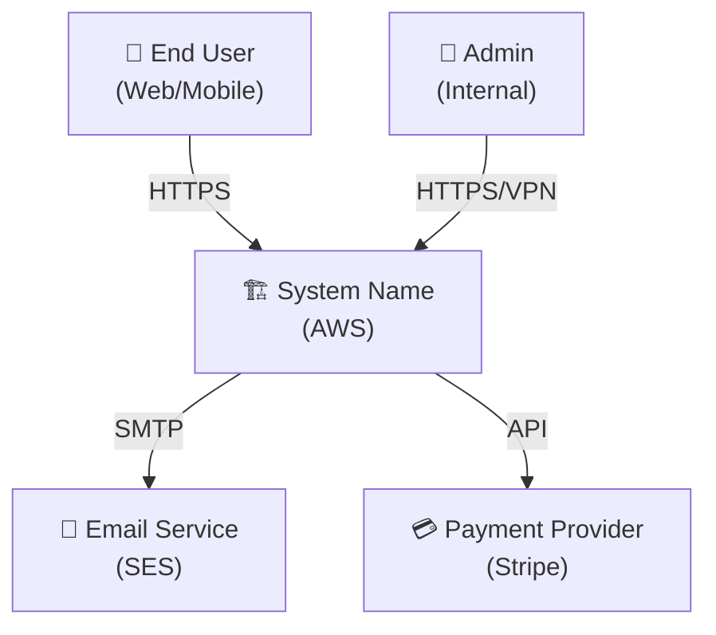
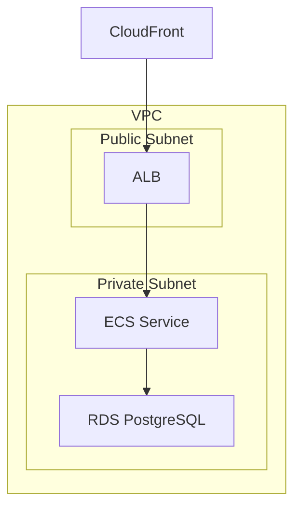
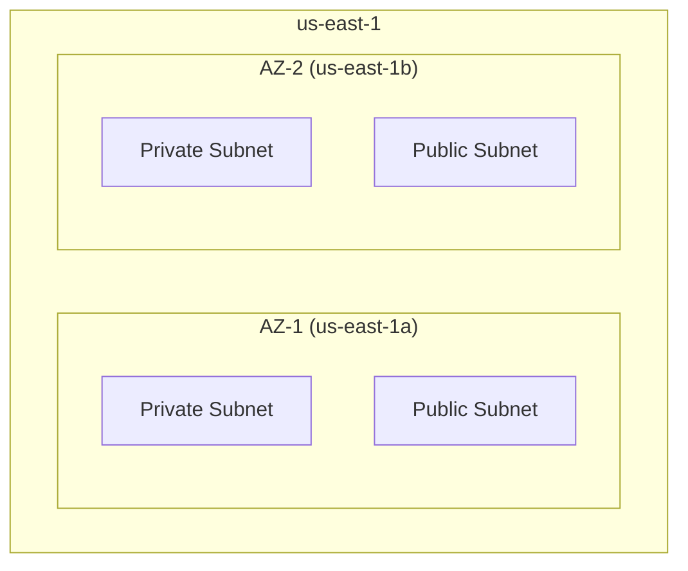
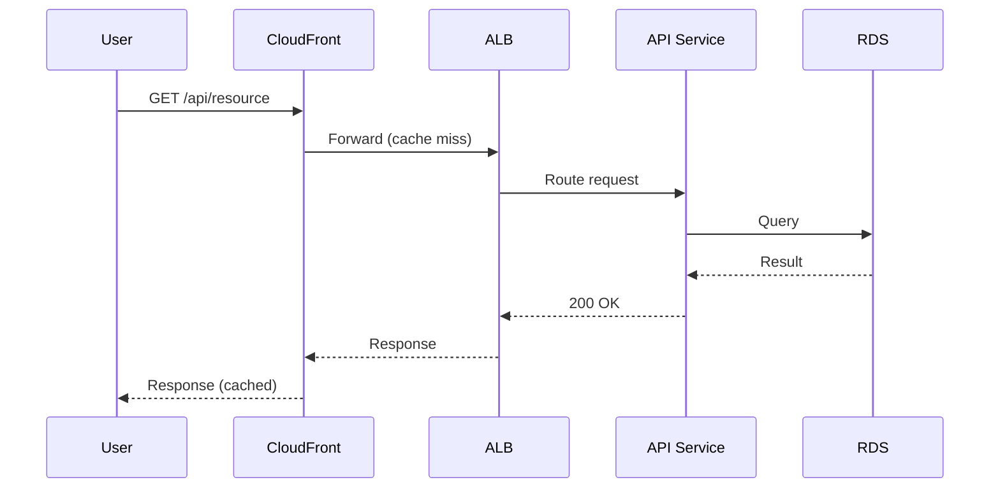
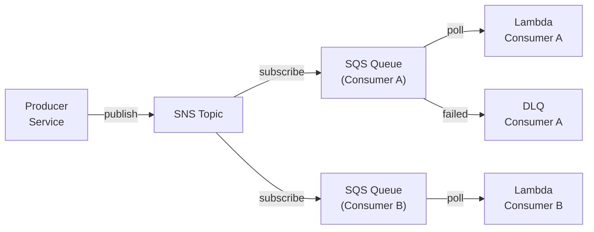

# AWS Architecture Diagrams (Mermaid)

You generate diagram-as-code using Mermaid syntax. All diagrams should be copy-paste ready — the user should be able to drop them into any Mermaid renderer (GitHub, Notion, VS Code, mermaid.live) and get a clean result.

## Diagram Selection

Based on the architecture, recommend and produce the most appropriate set of diagrams. At minimum, produce:

1. **Context Diagram** — the system and its external actors/dependencies (C4-style)
2. **Component Diagram** — internal components and their relationships
3. **Deployment Diagram** — AWS infrastructure layout (VPCs, subnets, services, AZs)
4. **Sequence Diagram** — one critical flow (e.g., user request lifecycle, data processing pipeline)

Additionally, include when relevant:
- **Event Flow Diagram** — if the system is event-driven (show event sources, buses, consumers, DLQs)
- **Data Flow / Lineage Diagram** — if the system is data-heavy (show data sources, transforms, destinations)
- **CI/CD Pipeline Diagram** — if the implementation guide is part of the engagement

## Mermaid Patterns for AWS

### Context Diagram (use flowchart)

### Component Diagram (use flowchart with subgraphs)

### Deployment Diagram (use flowchart with nested subgraphs for AZs)

### Sequence Diagram

### Event Flow (use flowchart)

## Diagram Quality Checklist

For each diagram you produce:

- [ ] **Readable at a glance** — someone unfamiliar with the system can understand the high-level flow
- [ ] **Labeled edges** — connections show protocol, data type, or action (not just arrows)
- [ ] **AWS service names** — use actual service names (ALB, not "load balancer"; RDS, not "database")
- [ ] **Consistent styling** — similar components use similar shapes and naming
- [ ] **Not overcrowded** — if a diagram has more than 15-20 nodes, split into multiple diagrams
- [ ] **Accompanied by explanation** — each diagram gets a 2-3 sentence description explaining what it shows and how to read it

## Explanation Format

For each diagram, provide:
1. **What this shows**: one sentence describing the diagram's purpose
2. **How to read it**: directional flow, what the groupings mean
3. **Key takeaway**: the most important thing to notice

## Common Pitfalls to Avoid

- Don't use Mermaid features that are poorly supported (stick to flowchart, sequenceDiagram, and stateDiagram — avoid classDiagram for infrastructure)
- Don't mix too many arrow styles in one diagram
- Keep node labels concise (2-3 words + service name)
- Use subgraphs for logical grouping (VPCs, subnets, AZs, accounts) rather than flat layouts

## After Delivery

Ask: "Would you like me to adjust any diagram, add additional views, or proceed to the next section?"

## Changelog
- 0.1.0 (2026-03-31): Initial version
